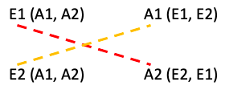
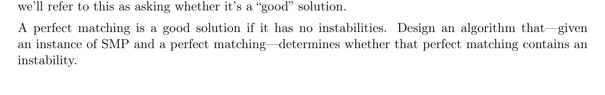

## Thoughts on the Stable Matching Problem

### When is a match unstable?

An "instability" occurs anytime the employer in one pairing prefers a different candidate in another pairing, and that candidate prefers the employer in the first pairing. 
We can tell that this is an instability because E1 prefers A1, and A1 prefers E1, and they're in different pairs.


``` 
Imagine that you apply for Google and Amazon, but end up getting hired by Amazon.

Now imagine that you find out that Google actually preferred you over the candidate that they hired on - you'd be pretty upset!

This is an example of an instability because both you and Google believe that the pairing would be better if you were employed by Google.

In an "ultra-capitalistic" society (as Suzanne mentioned in the lecture - basically think of this as a society where people/companies look out for themselves over everyone else), 

Google would fire their current employee and hire you on.

Then, since Amazon still needs an employee, and the "fired" Google applicant needs a job, they would pair up and we would have no instabilities.
```


